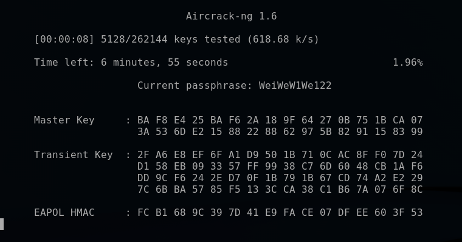

# WPA/WPA2 Cracking

1. Process of verifying the password
Using the information from Handshake combined with the password from the wordlist to generate the MIC. Compared this new MIC and the one in handshake, if they are the same, then this is the password.


2. In practice

```
# 1. ls the files
la

# 2. Cracking to compare the MIC
aircrack-ng [handshake file] -w [wordlist]
# -w: for a WPA2, we need to specify the wordlist
# e.g. aircrack-ng handshake.cap -w wordlist_test
# The speed depends on the processor and the size of the wordlist
# There are also online services that you can try where you upload the handshake and they have huge wordlist and they have super computers to run through
```



3. Faster the process
    1. Use the GPU rather than CPU
    2. Use rainbow tables
    3. Pipe the wordlist as it's being created in Crunch to Aircrack-ng. This way you can create bigger wordlist without using any storage on your computer
    4. Use social engineering to get the password using an evil twin attack where you trick one of the users to give you the password

