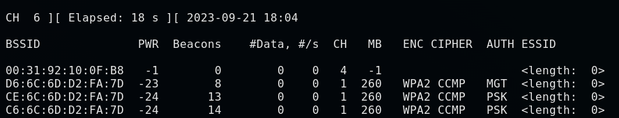

# Discover the network

1. airodump-ng: a packet sniffer(used to capture all packets within range; display detailed info about networks around us; etc)
    1. part of the aircrack-ng suit
    2. Discover the Network
        1. Change the MAC Address and Change into the monitor mode
        2. using airodump-ng
        ```
        airodump-ng [interface name]
        ```
        3. Quit the program
        Ctrl + C (Can quit any program running in the terminal)
    3. Analyse the show
        
        1. ESSID: the names of the wireless networks around us
        2. BSSID: the MAC address of the target network
        3. PWR: the signal strength(higher the number, better the signal)
        4. Beacons: frames sent by the network in order to broadcasr it's existence
        5. \#Data: the useful packets
        6. \#/s: the number of data packets that we collected in the past 10 seconds.
        7. CH: channel that the networks works on.
        8. MB: Maximum speed supported by the network
        9. ENC: the encryption use by the network(e.g. WPA, WEP, WPA2)
        10. CIPHER: the cipher used in the network(e.g. CCMP, WEP)
        11. AUTH: the authenfication used on that network(e.g. PSK(Pre-Shared Key), MGT)


