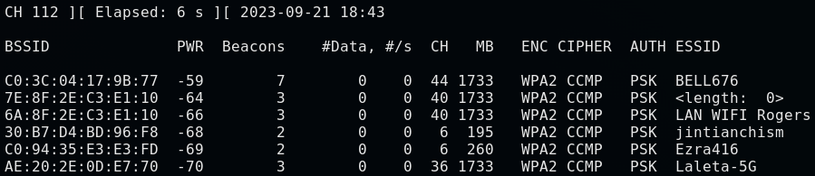

# Wifi Bands

1. 2.4Ghz(Gigahertz)
    1. When we are using airodump-ng, we are only sniffing on 2.4Ghz.

2. 5Ghz
    1. We need to specify to listen to 5Ghz
    ```
    airodump-ng --band a [interface name]
    # we can specify more than 1 band
    # airodump-ng --band abg [interface name]
    # Can capture both 2.4 and 5 Ghz frequencies at the same time
    ```
    

3. Bands
    1. a: uses 5Ghz frequency only
    2. b, g: both use 2.4Ghz frequency only
    3. n uses 5 and 2.4 Ghz
    3. ac uses frequencies to talk about WiFi Bands
