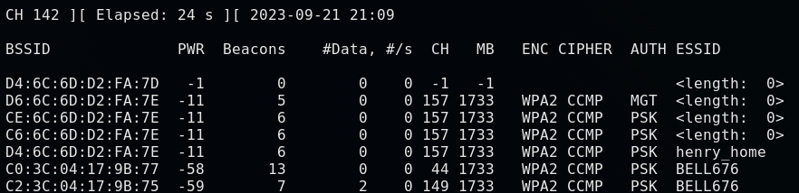
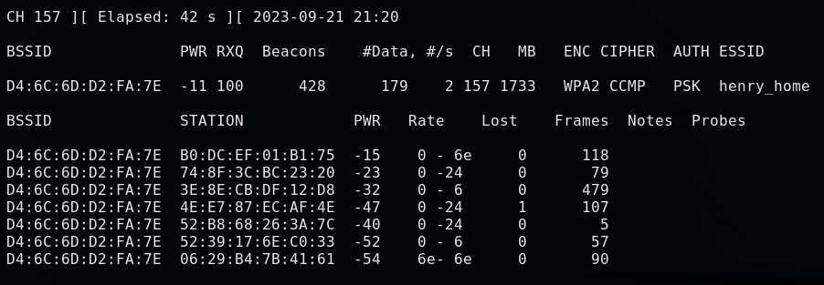

# Packet Sniffing

1. Get basic information about the target network


2. Get more information of the target
    1. We can only see the target network now
    2. We can see all clients and devices connected to the target network (Under the station)
        1. PWR: Signal Strength of each of the devices
        2. Rate: Speed
        3. Lost: Amount of data lost
        4. Frames: the amount of data we have captured
```
airodump-ng --bssid [BSSID] --channel [Channel] --write [folder] [interface name]
# Specify the MAC Address of the network
# Specify the Channel to sniff on
# Gather the infomation into a folder
# e.g. airodump-ng --bssid D4:6C:6D:D2:FA:7E 157 --channel 157 --write test wlan0
```



3. We can find the file containing the data we just captured
    1. ls to list all the files
        1. It'll automatically appends minus 01
        2. the main file is the .cap file, which will contain every info they sent but they are using encryption
        3. the data collected is encrypted
    
    