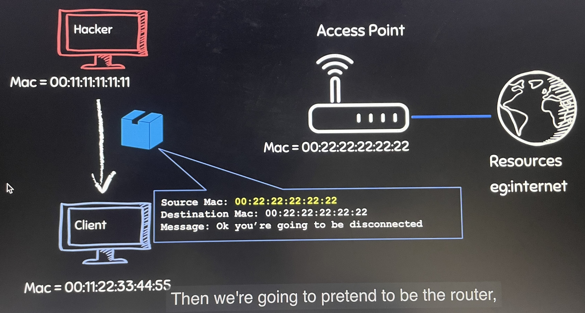
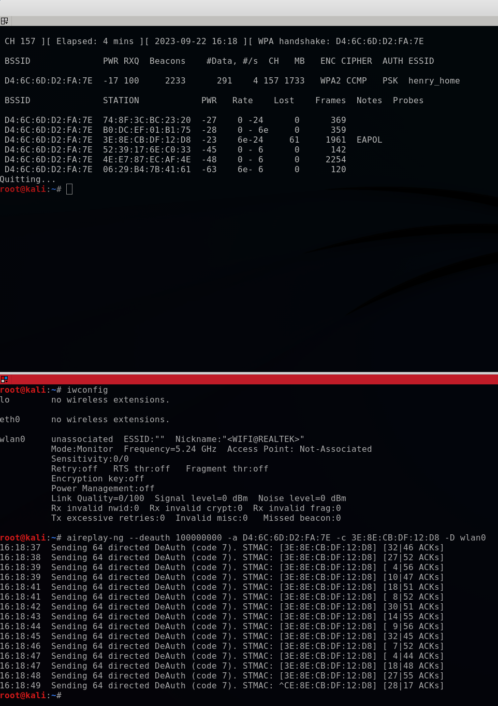

# Deauthentication Attack

1. Deauthentication Attack: Disconnect any client from any network
    1. Works on encrypted networks(WEP, WPA & WPA2)
    2. No need to know the network key.
    3. No nedd to connect to the network

2. Procedure: 
    1. We're going to pretend to be the client that we want to disconnect by changeingour MAC address to the MAC address of that client and tell the router that I want to disconnect from you.
    2. Then we're going to pretend to be the router, by changing out MAC Address to the router's MAC Address and tell the client that you requested to be disconnected so i'm going to diconnect you.
    3. This will allow us to successfully disconnect or deauthenticate any client from any network.


3. Using aireplay-ng
    1. Command
    ```
    aireplay-ng --deauth 100000000 -a [MAC Address of the target network] -c [MAC Address of the target client] -D [interface name]
    # 100000000 is number of deauthentication packets that I want to send. It's always very large so can keep sending it to both the router and the target device to disconnect it for a long time.
    # Add -D is the target is 5Ghz
    ```
    2. Sometimes the client will automatically connect to a new network, which we just need to do this again
    3. Always, when we want to make it successful, we need to split the terminal window and run the packet sniffing and deauth at the same time.
    ```
    airodump-ng --bssid [BSSID] --channel [Channel] [interface name]
    ```
    

4. What we can do
    1. Where you could disconnect clients from the target network and then call the user and pretend to be a person from the IT department and ask them to install a virus or a backdoor telling them that this would fix their issue.
    2. You could also create another fake access point and get them to connect to the fake access point and then start spying on them rom that access point.