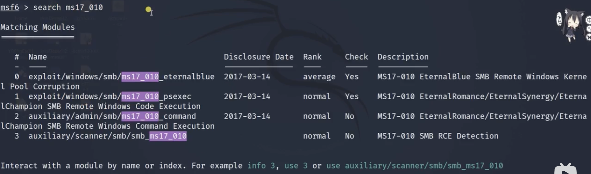

# Basic of Metasploit(MSF)

****

## Content
*

****
## Get the Admin Authority
1. Open the terminal
```
sudo su
```
2. Input the keys, which is `kali' in default.

****
## Enter the msf console
```
msfconsole
```

****
## Use the msf
Give the procedure of using ms17_010 as an example which damages a lot in 2017. ms17 means it's a leak in 2017, 010 means it's the number 10 leak.
1. Choose and use the selected module
```
# Search for the module
search ms17_010
```



3. Set up the selected module


4. Run the module


